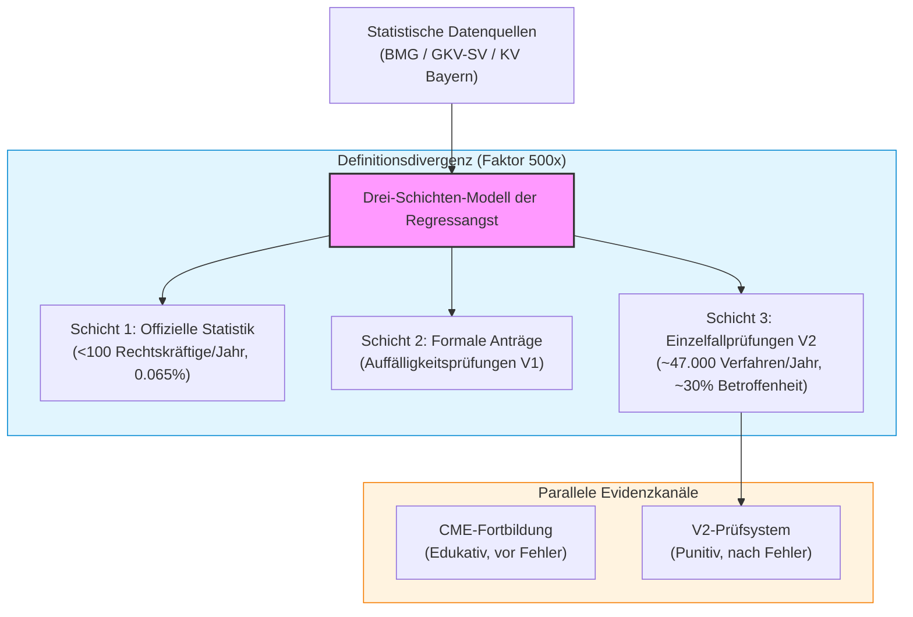

# Regressangst — German Prescribing-Audit Recourse Anxiety (ST-001)

> **English summary:** Working-paper repository for ST-001, a systems-theory analysis of recourse anxiety in German statutory health-insurance prescribing audits (§§ 106 ff. SGB V). Published by [Um:bruch](https://um-bruch.org), CC BY 4.0. PDFs and source in this repository. | **🇩🇪 [Deutsche Dokumentation ↓](#startpunkte)**

> [!NOTE]
> **Maschinenlesbarer Kontext für KI-Agenten:** Eine kompakte Repository-Übersicht für LLMs, RAG-Crawler und automatisierte Indexer befindet sich in [`llms.txt`](llms.txt).

---

  

> **Um:bruch — Denkfabrik für gesellschaftlichen Wandel**
>
> **Status: Working Paper / multiperspektivische Bestandsaufnahme mit Pilot-Charakter** — v0.22, April 2026 | CC BY 4.0
>
> Dieses Projekt ist ein laufendes Forschungsvorhaben. Die Befunde basieren auf öffentlich zugänglichen Quellen und KI-gestützter Analyse, nicht auf eigener Primärerhebung. Alle Ergebnisse sind vorläufig und werden laufend aktualisiert. Eine Einreichung bei einem Peer-Review-Journal ist noch nicht erfolgt. Wir veröffentlichen als Working Paper, um Transparenz über den Forschungsprozess herzustellen und Feedback zu ermöglichen.

---

## Startpunkte

| Ziel | Einstieg |
|------|----------|
| Studie lesen | [`pdf/ST-001_Studie_Regressangst.pdf`](pdf/ST-001_Studie_Regressangst.pdf) |
| Kurzfassung deutsch | [`pdf/ST-001_Executive_Summary.pdf`](pdf/ST-001_Executive_Summary.pdf) |
| Executive Summary English | [`pdf/ST-001_Executive_Summary_EN.pdf`](pdf/ST-001_Executive_Summary_EN.pdf) |
| Regress-Transparenzportal | [`pdf/PP-003_Regress_Transparenzportal.pdf`](pdf/PP-003_Regress_Transparenzportal.pdf) |
| Quellen- und Recherchekern | [`recherche/MASTER-CORE.md`](recherche/MASTER-CORE.md) |
| Versionsstand prüfen | [`meta/VERSIONIERUNG.md`](meta/VERSIONIERUNG.md) |

**Canonical Repository:** <https://github.com/um-bruch/regressangst>

**Öffentliche Projektseite:** <https://um-bruch.org/projekte/>

Suchkontext: `Regressangst`, `Wirtschaftlichkeitsprüfung`, `ST-001`, `PP-003`, `Regress-Transparenzportal`, `ärztliche Regressangst`, `Um:bruch Regress-Melder`.

## Systemarchitektur & Definitionsdivergenz

## Forschungsfrage

Das deutsche Wirtschaftlichkeitsprüfsystem (§§ 106 ff. SGB V) erzeugt eine Regressangst unter Vertragsärzten, deren Folgekosten die durchgesetzten Regresse nach Modellrechnung um das 100- bis 1.000-fache übersteigen könnten.

Die offizielle Regressquote liegt „unter 1 %" — dennoch berichten 72 % der Hausärzte, mindestens einmal einen Regress erlebt zu haben (Ribbat et al. 2023, n=770, TU München). **Was passiert im System, das beides zugleich produziert?**

## Zentrale Befunde (vorläufig)

Diese Befunde basieren auf der Analyse öffentlich zugänglicher Daten und Literatur. Sie werden gegen den **MASTER-CORE** (`recherche/MASTER-CORE.md`) abgeglichen, der als paperübergreifender Referenzrahmen dient.

1. **Definitionsdivergenz (originär):** „Unter 1 %" und „72 %" sind kein Widerspruch — sie messen verschiedene Dinge. Der Begriff „Regress" wird auf drei Schichten definiert: Schicht 1 (<100/Jahr, nur V1, rechtskräftig, 0,065 %) vs. Schicht 3 (ca. 47.000 V2-Verfahren/Jahr laut BMG GVSG 2024, ~30 %). **Faktor ~500×.** Die Diskrepanz ist kein Wahrnehmungsfehler der Ärzte, sondern ein Messproblem der Statistik. Nach Prior-Art-Check originär.

2. **V1-Schutzstufenmodell:** Die Auffälligkeitsprüfung (V1) ist fairer als in der öffentlichen Debatte dargestellt (Anhörung, Beratung, Karenzzeit, Deckel 25.000 EUR). Die 99,7 %-Verwerfungsrate ist kein Systemversagen, sondern ein funktionierendes Schutzmodell.

3. **V2a/V2b-Differenzierung:** Die Einzelfallprüfung (V2) zerfällt in V2a (Unwirtschaftlichkeit, medizinische Verteidigung möglich) und V2b (Formfehler, medizinisch irrelevant, keine Heilung, kein Beratungsschutz). Der Zertifikatsfehler gilt in voller Schärfe nur für V2b.

4. **Doppelfunktion (originär):** ~35 % der V2-Prüfungen codieren medizinische Evidenz als Formregeln (Kategorie A: Biosimilar-Pflicht, AM-RL). ~40 % sind reine Formalkontrolle (Kategorie B). Das System hat zwei parallele Evidenzkanäle: CME (edukativ, vor Fehler) vs. V2 (punitiv, nach Fehler) — ohne Verbindung. Nach Prior-Art-Check originär.

5. **Empirische Bestätigung:** Bayern: 13.332 festgesetzte Regresse (2024) bei ~24.000 Ärzten, Durchschnitt 334 EUR, ~70 % Bagatelle (SpiFa). Poisson-Modell (λ=0,85) ergibt 57 %/Jahr Betroffenheit — Ribbats 72 % sind rechnerisch plausibel.

## Einschränkungen und offene Fragen

- Die Studie ist eine **Sekundäranalyse** — keine eigene Primärerhebung. Alle Daten stammen aus öffentlichen Quellen.
- Die Prozentanteile der Doppelfunktion (35/40/25 %) sind **Schätzungen**, nicht empirisch gemessen.
- Die Folgekostenrechnung (0,9–1,7 Mrd. EUR/Jahr) beruht auf **Szenario-Annahmen** mit transparenten Parametern.
- Der kausale Schluss „Prüfdruck → Unterversorgung" ist **nicht empirisch geschlossen** (Ribbat misst Selbstbericht, nicht Versorgungsergebnisse).
- Eine unabhängige **Replikation** der Ribbat-Befunde steht aus.
- 9 **IFG-Anfragen** sind eingereicht (Frist ~10.05.2026) und könnten die Datenlage wesentlich verändern.

## Dokumente

### Wissenschaftliche Publikationen (in `paper/` und `pdf/`)

| Dokument | Version | Seiten | Beschreibung |
|----------|---------|--------|--------------|
| **ST-001** | v0.22 | 104 | Hauptstudie mit 7 Teilen + Gegenposition + Schlusskapitel + Anhängen. P0/P1/P2-Review und PDF-Kommentarrunden umgesetzt. |
| **ST-001 ES (DE)** | v1.3 | 16 | Executive Summary mit Asymmetrie-Subsection, aktualisierter Regressquoten-Bandbreite und KNV-Tabelle (15 Maßnahmen inkl. Versorgungsprüfung) |
| **ST-001 ES (EN)** | v1.3 | 16 | English executive summary synchronized with ST-001 v0.22 |
| **PP-003** | v3.1 | 40 | Konzeptpapier: Regress-Transparenzportal mit Forderungskatalog, Trägerschaftsszenarien und aktualisierter Kostenkalkulation |

### Struktur der Hauptstudie (ST-001)

| Teil | Inhalt | Methode |
|------|--------|---------|
| I | Historische Schichtung (Container-Genealogie 1989–2026) | Gesetzeshistorik, BT-Drucksachen |
| II | Rechtsdogmatische Lücke (Zertifikatsfehler, V2a/V2b) | BSG-Analyse, Normexegese |
| III | Verhaltensökonomie (Ribbat, Spieltheorie, Poisson) | Sekundäranalyse, Modellierung |
| IV | Folgekosten (0,9–1,7 Mrd. EUR Szenario) | Dreistufenmodell, Hochrechnung |
| V | Institutionelles Schweigen (GKV-SV, Public Choice) | Dokumentenanalyse |
| VI | Internationaler Vergleich (FR, CH, UK, NL) | Komparatistik |
| VII | Lösungsraum (14 Maßnahmen, KNV-Ranking) | Kosten-Nutzen-Analyse |
| Gegenposition | 6 Einwände mit Antworten | Selbstkritik, Devil's Advocate |
| Anhang A | Glossar | — |
| Anhang B | Methodik (Walk of Analysis, 15 Agenten) | Prozessdokumentation |
| Anhang C | IFG-Anfragen (9 eingereicht) | Offene Forschungsfragen |

### Forschungsdokumentation (in `recherche/`)

- **MASTER-CORE.md** — Zentrale Kernergebnisse und Methodik (paperübergreifender Referenzrahmen für Konsistenz)
- **METHODIK_RECHERCHE_PROTOKOLL.md** — Suchstrategien, Quellen, Befunde pro Forschungsfrage
- **WALK_OF_ANALYSIS_EXTENDED.md** — Vollständiger Analyseverlauf (14 Phasen, 8 Wissensschichten)
- **SOURCE_Schutzinstrumente.txt** — Korrekte Rechtslage der 4 Schutzinstrumente (§ 29 BMV-Ä, BSG 27/12 R)
- **40 Einzelanalysen** in `recherche/einzelanalysen/` (RECHERCHE_*, MODELL_*, NACHANALYSE_*, ANALYSE_*)

### Meta (in `meta/`)

- **VERSIONIERUNG.md** — Dokumentenhierarchie und Versionsmatrix
- **MASTERPLAN_V2.md** — 6-Phasen-Fertigstellungsplan

## Methodik

### Forschungsdesign

KI-gestützter Multi-Stream-Analyseprozess (April 2026, ~60–80 Stunden Mensch+KI). Vier Modelle arbeitsteilig: Claude Opus 4.6 (Primäranalyse), Copilot GPT-4o (Konzeptschärfung), Gemini Deep Research (Theorierahmen), Mensch (Steuerung, Richtungsentscheidungen).

### Besonderheiten

- **Cross-Source-Divergenz** statt nur Cross-Model: 15 spezialisierte Agenten, 25 Datenpunkte, 14 unabhängige Domains
- **Naive-Suche-Test:** Simulierter Journalist findet „unter 1 %" in den ersten 5 Treffern
- **Prior-Art-Checks:** Zwei systematische Suchen (je 20+ Anfragen) bestätigten Originalität beider Synthesen
- **Alternative Hypothese getestet:** H2 (System = Evidenzsteuerung) hat 35–40 % Erklärungskraft — anerkannt statt ignoriert
- **5 dokumentierte Hypothesenrevisionen** (u. a. Datierung Einzelfallprüfung, Moosazadeh-Fehlzuordnung, Kostenmodell)

### Einschränkungen der Methodik

- Agent-Prompts sind als Suchstrategien dokumentiert, aber die vollen Instruktions-Texte liegen nicht immer vor
- Gemini-Outputs erforderten systematischen Double-Check (dokumentierte Halluzinationen: Moosazadeh, französische Protestzahlen)

---

## Lizenz & Zitierweise

CC BY 4.0 — Um:bruch (2026): *Regressangst — Systemtheoretische Aufarbeitung der Wirtschaftlichkeitsprüfung (§§ 106 ff. SGB V)*. Working Paper ST-001, v0.22. URL: <https://github.com/um-bruch/regressangst>.

Dritthersteller-Lizenzen und Dependency-Inventur: [`THIRD_PARTY_LICENSES.txt`](THIRD_PARTY_LICENSES.txt).

